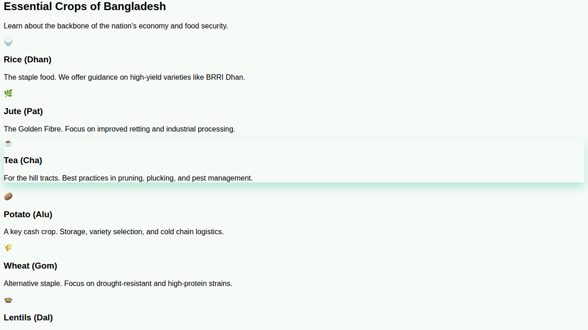
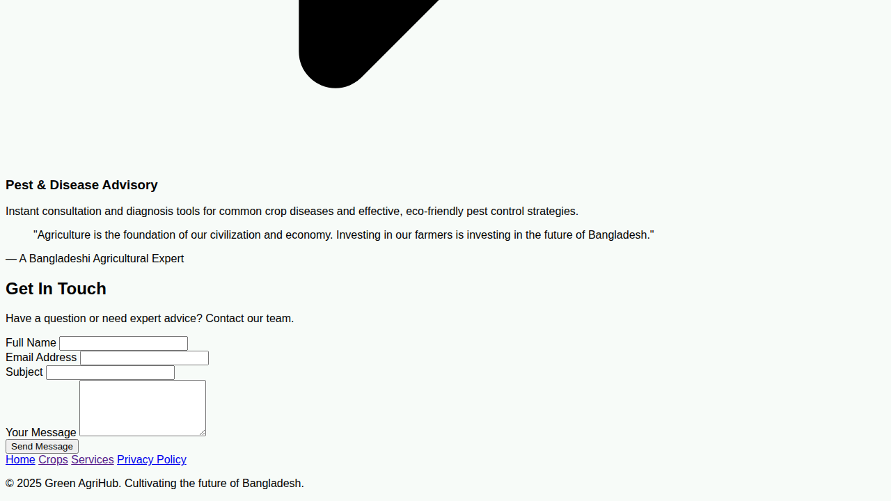

# Green-AgriHub
Green AgriHub is a central web hub for Bangladeshi agriculture, focusing on sustainable farming, market data, and modern tech. It offers real-time market prices, guides on irrigation and soil testing, and pest/disease advisory services to help farmers increase yield and prosperity.

## Screenshots

### Full Page View

### Homepage Hero Section

### Essential Crops Section

### Core Services Section

### Contact Form Section

## Features

- **Real-time Market Prices**: Get up-to-the-minute price data for key commodities across different Bangladeshi markets
- **Essential Crops Information**: Learn about Rice, Jute, Tea, Potato, Wheat, Lentils, Mango, and Vegetables
- **Modernization & Tech**: Access guides on irrigation systems, soil testing, and climate-resilient farming methods
- **Pest & Disease Advisory**: Instant consultation and diagnosis tools for common crop diseases
- **Contact Form**: Easy way to get in touch with agricultural experts
